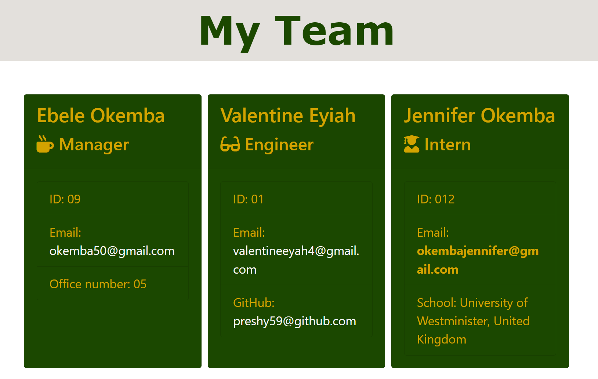

<!-- PROJECT TITLE -->

<h3 align="center">TEAM PROFILE GENERATOR</h3>

 

<!-- TABLE OF CONTENTS -->

  
Table of Contents

  <ol>
    <li>
      <a href="#project-description"> Project Description</a>
      <ul>
        <li><a href="#built-with">Built With</a></li>
      </ul>
    </li>
    <li>
      <a href="#getting-started">Getting Started</a>
      <ul>
         <li><a href="#installation">Installation</a></li>
          <li><a href="#run-locally">Run Locally</a></li>
      </ul>
    </li>
    <li><a href="#usage">Usage</a></li>
    <li><a href="#contributing">Contributing</a></li>
    <li><a href="#demo">Demo</a></li>
    <li><a href="#license">License</a></li>
    <li><a href="#question">Questions</a></li>
    </ol>

<!-- DESCRIPTION OF THE PROJECT -->
## Project Description
"This project is basically design to display the team profile file created by the user through the dynamic creation of element in JavaScript. The user is except to create various classes in relation to the profile to be created to pass their corresponding unit test file and afterwards, generated a series of propmt question that will gather together the information needed to create various team member profile. The answer provided in the console is to be generated into a html file that will display the details of the various team member created. 

### Built With

 * HTML
 * CSS
 * JAVASCRIPT
 * NODE.JS
 * ES6

<!-- GETTING STARTED -->
## Getting Started

Below is instruction on how to install the project locally to test is functionality.

### Installation
Follow the steps below to install this incridiable project:

1. Clone the repo
   'sh
   git clone 
   '
2. Install NPM packages
   'sh
   npm install
   '

<!-- USAGE EXAMPLES -->
## Usage
"To be able to use the project the user have to type in answer to provide information relating to the options (add manager,add engineer, add intern , finish build team) ouline in the console when prompt. When the user is done adding all the team profile and selected "Finish building the team", a html file is been generated which consist of all details provided. The user can view the file in the output folder which is where the file is stored in order to view the result of all the input provided while in the console mode.

<!-- DEMO ON HOW THE PROJECT WORKS -->
## Demo

<!-- CONTRIBUTING -->
## Contributing

"Contribution are always welcome, as it what make the open source community such an amazing place to learn, create and inspire. if you wish to contribute and make the project better, find below the step that  are to be followed to get started"
1. Fork the Project
2. Create your Feature Branch ('git checkout -b feature/team_profile_generator')
3. Commit your Changes ('git commit -m 'Add some team_profile_generator'')
4. Push to the Branch ('git push origin feature/team_profile_generator')
5. Open a Pull Request

<!-- LICENSE -->
## License

Distrubed under the 

<!-- QUESTIONS -->
## Questions

Email : okemba50@gmail.com
Profile : https://github.com/preshy59
Project Link: https://github.com/preshy59/team_profile_generator